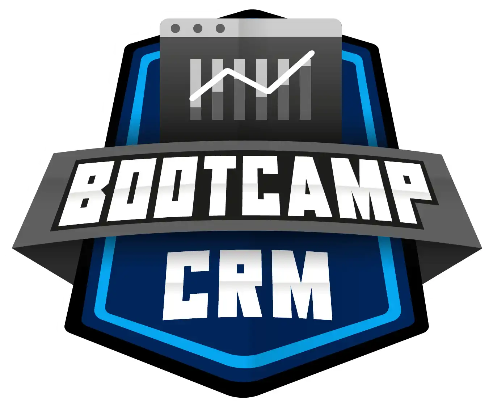

# Bootcamp-Microsoft-Dynamics-365

- 34 cursos.
- 4 desafios de projeto.
- 5 desafios de código.
- 1 live.
- 6 Mentorias.
- Carga Horária 95h.
- Data de Início: 06/03/23.
- Finalizado em: 20/05/23.
- Data Final: 30/05/23.
- Tecnologias: C# e JS...
- <a href="https://www.dio.me/certificate/493F7281">Certificação:</a>

Em parceria com a Microsoft, a DIO, desenvolve um Bootcamp Microsoft Dynamics 365! Embarque agora em uma trilha de 95 horas, com conteúdos do básico ao avançado das ferramentas e soluções da Microsoft Dynamics 365, dispondo da possibilidade de certificação e formação 100%. O Bootcamp ideal para profissionais de TI com conhecimento em outras linguagens de programação que desejam aprender a desenvolver soluções personalizadas no Dynamics 365, desenvolvedores(as) de ferramentas Low Code e quem está sempre em constante desenvolvimento profissional.
